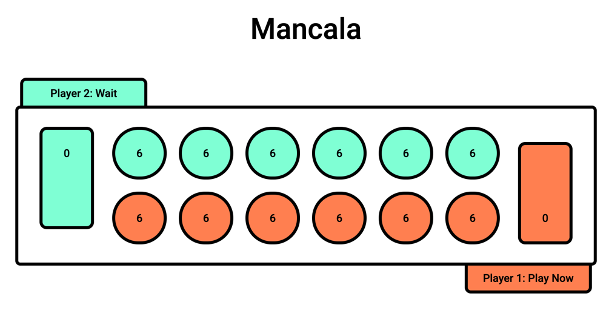

# Felipe Teles dos Santos



## Run application:
```
./mvnw package
./mvnw spring-boot:run
```

Accessing the UI:
http://localhost:8080/index.html

## API

API stack:

- Java version: 11
- Spring boot 2.5.4
- H2 Database Engine

Basic API documentation swagger file: [swagger.yml](docs/api/swagger.yml).

## UI

- React 17.0.2

Running the UI isolated from the Java project requires:

- node 14.17.6
- yarn 1.22.5

### Running React manually:

Config file location: ui/env.sample. Steps to change config properties:

- copy `.env.sample` to `.env.local`
- replace the value of the `REACT_APP_SERVER_URL` property with the API base URL
- run `yarn` to download dependencies
- run `yarn start` to start the react app